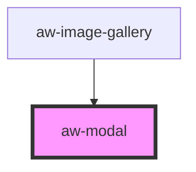

# aw-modal

<!-- Auto Generated Below -->

## Properties

| Property    | Attribute    | Description                                      | Type      | Default     |
| ----------- | ------------ | ------------------------------------------------ | --------- | ----------- |
| `noBorder`  | `no-border`  | Indicates if the modal should have round borders | `boolean` | `undefined` |
| `noPadding` | `no-padding` | Indicates if the modal should have a padding     | `boolean` | `undefined` |

## Events

| Event         | Description                            | Type                   |
| ------------- | -------------------------------------- | ---------------------- |
| `modalClosed` | Event emitted when the modal is closed | `CustomEvent<boolean>` |

## Methods

### `close() => Promise<void>`

#### Returns

Type: `Promise<void>`

### `open() => Promise<void>`

#### Returns

Type: `Promise<void>`

## Dependencies

### Used by

 - [aw-image-gallery](../image-gallery/aw-image-gallery)

### Graph

----------------------------------------------

*Built with [StencilJS](https://stenciljs.com/)*
