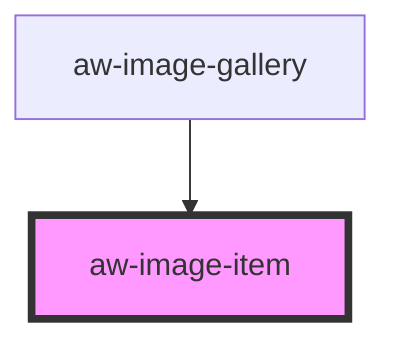

# aw-image-item

<!-- Auto Generated Below -->

## Properties

| Property                | Attribute      | Description | Type     | Default     |
| ----------------------- | -------------- | ----------- | -------- | ----------- |
| `imageAlt`              | `image-alt`    |             | `string` | `undefined` |
| `imageHeight`           | `image-height` |             | `string` | `undefined` |
| `imageSrc` _(required)_ | `image-src`    |             | `string` | `undefined` |
| `imageWidth`            | `image-width`  |             | `string` | `undefined` |

## Events

| Event            | Description                                   | Type                |
| ---------------- | --------------------------------------------- | ------------------- |
| `imageItemError` | Event emitted on error with the image loading | `CustomEvent<void>` |

## Dependencies

### Used by

 - [aw-image-gallery](../aw-image-gallery)

### Graph

----------------------------------------------

*Built with [StencilJS](https://stenciljs.com/)*
